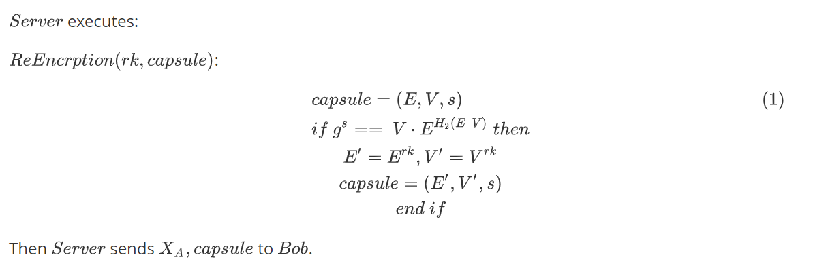

# goRecrypt
`goRecrypt` is a tool to execute proxy re-encryption algorithms. It offers a high-level API to easily implement the process of re-encryption.

# Introduction and Theory


## Prerequisites


## Encrypt


## ReKeyGen


## ReEncryption



## ReCreateKey


## Decrypt


# Getting started

## Install

```sh
$ go get -v github.com/SherLzp/goRecrypt
```

## Test

### Code

```go
package main

import (
	"fmt"
	"github.com/SherLzp/goRecrypt/goRecrypt"
)

func main{
    aPriKey, aPubKey := goRecrypt.GenerateKeys()
	bPriKey, bPubKey := goRecrypt.GenerateKeys()
	m := "Hello Proxy Re-Encryption"
	cipherText, capsule := goRecrypt.Encrypt(m, aPubKey)
	fmt.Println("ciphereText:", cipherText)
	rk, pubX := goRecrypt.ReKeyGen(aPriKey, bPubKey)
	fmt.Println("rk:", rk)
	newCapsule := goRecrypt.ReEncryption(rk, capsule)
	key := goRecrypt.RecreateKey(bPriKey, newCapsule, &pubX)
	plainText := goRecrypt.Decrypt(cipherText, key)
	fmt.Println("plainText:", string(plainText))
}
```

### Result

```go
ciphereText: [171 87 67 89 115 56 249 20 175 99 198 164 68 80 106 118 72 202 162 201 182 90 61 110 186 252 246 7 128 253 145 145]
rk: 55936314470925812361865801892579587803315572011336880167651467596145742731730
plainText: Hello Proxy Re-Encryption
```

Thanks! 